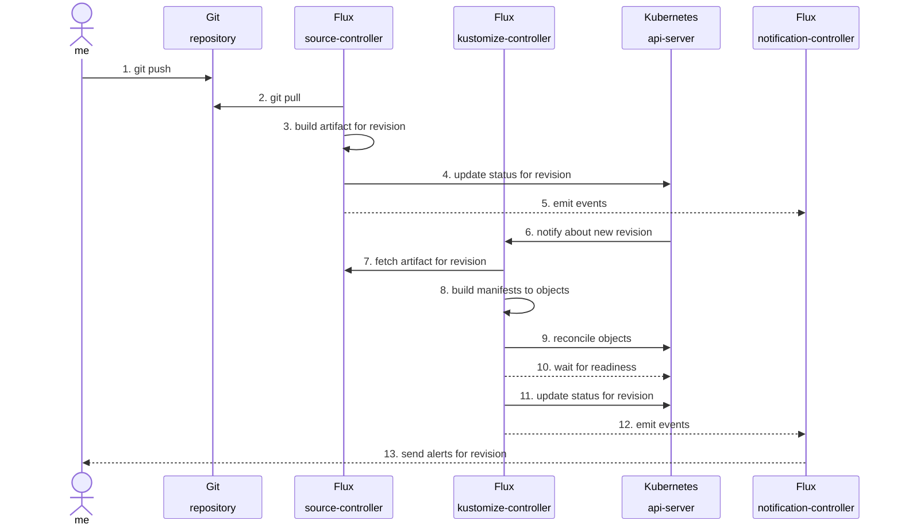
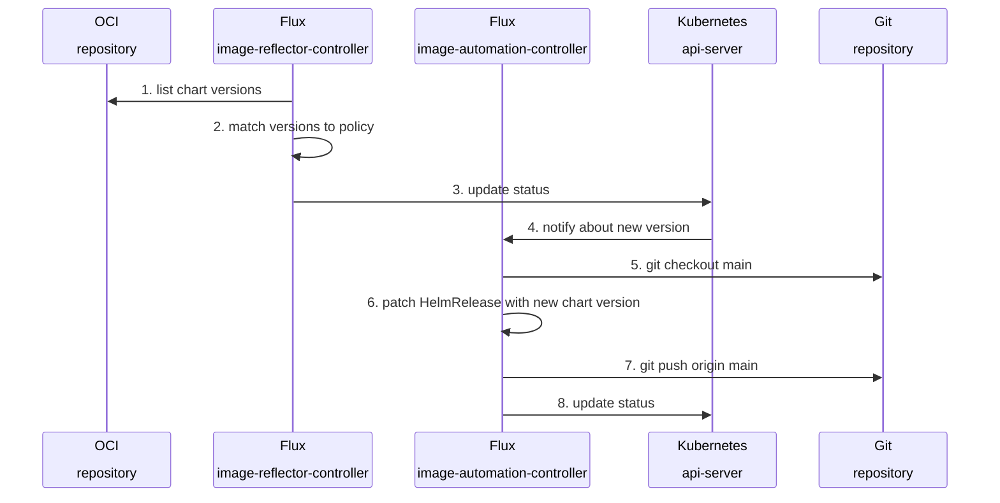
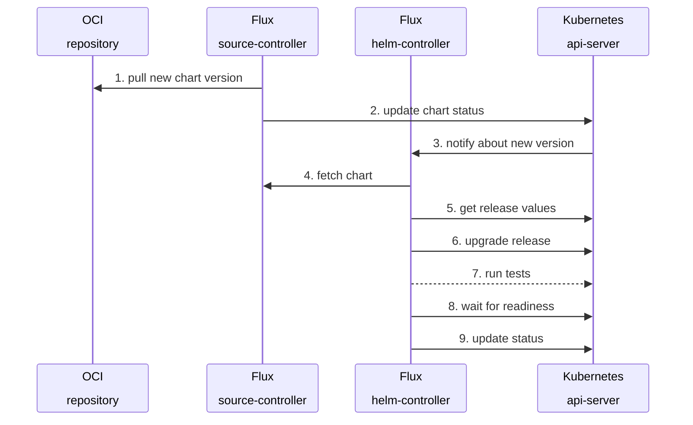

# d1-infra

> [!NOTE]
> This repository is part of the reference architecture for the
> [ControlPlane Enterprise for Flux CD](https://github.com/controlplaneio-fluxcd/distribution).
> 
> The `d1` reference architecture comprised of 
> [d1-fleet](https://github.com/controlplaneio-fluxcd/d1-fleet),
> [d1-infra](https://github.com/controlplaneio-fluxcd/d1-infra) and
> [d1-apps](https://github.com/controlplaneio-fluxcd/d1-infra)
> is a set of best practices and production-ready examples for using Flux
> to manage the continuous delivery of Kubernetes infrastructure and
> applications on multi-cluster multi-tenant environments.

## Scope and Access Control

This repository is managed by the platform team who are responsible for
the Kubernetes infrastructure.

This repository is used to define the Kubernetes infrastructure components such as:

- Cluster add-ons (CRD controllers, admission controllers, monitoring, logging, etc.)
- Cluster-wide definitions (Namespaces, Ingress classes, Storage classes, etc.)
- Pod security standards
- Network policies

This repository is reconciled on the cluster fleet by Flux as the **cluster admin**.
Access to this repository is restricted to the platform team and the
[Flux bot account](https://github.com/controlplaneio-fluxcd/d1-fleet?tab=readme-ov-file#create-a-github-account-for-flux).

## Repository Structure

This repository contains the following directories:

- The **components** dir contains Flux HelmReleases for cluster addons with custom
  configuration per environment.
- The **update** dir contains the Flux configuration for automating the OCI chart updates
  of the Helm releases.

A cluster component is defined in a directory with the following structure:

```sh
component/
├── controllers # CRD definitions and controllers
│   ├── base # common definitions (Namespaces, RBAC, HelmRepositories, HelmReleases)
│   ├── production # production specific HelmRelease values
│   └── staging # staging specific HelmRelease values
└── configs # Custom Resources of controllers
    ├── base # common definitions
    ├── production # production specific values
    └── staging # staging specific values
```

The CRDs and their controllers are reconciled before the custom resources to ensure that the
controllers are ready to process the custom resources.

## Continuous Delivery

To prevent reconciliation errors due to malformed YAML manifests or invalid Kubernetes definitions,
changes to the `main` branch should be made through pull requests. On pull requests a GitHub Action
runs that downloads the Flux OpenAPI schemas, and validates the custom resources and the kustomize
overlays using `kubeconform`.

Changes to the `main` branch are automatically reconciled by Flux on the staging cluster.



After the changes are reconciled on staging, the platform team can promote the changes
to the production clusters by merging the `main` branch into the `production` branch.

## Helm Release Automation

The staging cluster runs the Flux image automation controllers which automatically
update the HelmRelease definitions with the latest chart version.

When a new chart version is pushed to the container registry, and if it matches the semver policy,
Flux will update the HelmRelease YAML definitions and will push the changes to the `main` branch.



After the changes are pushed to the `main` branch, the HelmReleases will be upgraded to the new
chart versions on the staging cluster.


